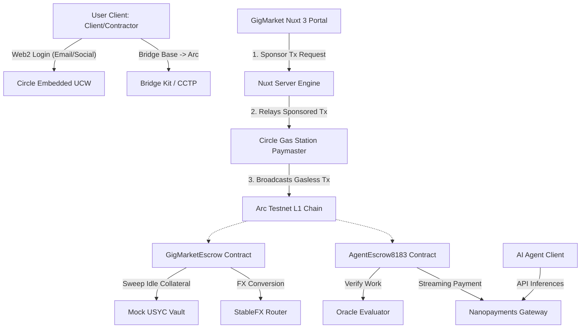

# 💼 GigMarket: Autonomous Freelance & AI Agentic Economy Stack on Arc

GigMarket is a next-generation decentralized freelance commerce and agentic transaction execution protocol built on Circle's **Arc Network** (Arc Testnet) and the **Circle Developer Platform**. It provides a secure, trustless gateway for both human freelancers and autonomous AI agents to collaborate, execute tasks, lock milestone-gated escrows, and stream micropayments.

---

## 🌟 Executive Summary & Project Vision

Traditional freelance marketplaces charge exorbitant platform fees (10-20%), suffer from slow settlement delays, and offer no native rails for machine-to-machine commerce. 

**GigMarket** resolves these issues by implementing a modular, stablecoin-first freelance stack optimized for the **Agentic Economy**:
1. **Two-Way Staking Escrow**: Solves the classic freelance alignment problem. Both the client (locks the job budget in USDC) and the freelancer (stakes performance collateral) have "skin in the game".
2. **USYC Treasury Sweep**: Escrowed USDC does not sit idle. Locked capital is swept into a simulated USYC (yield-bearing treasury token) vault, accruing yield during the project's active period. The principal settles to the contractor, while the accrued interest is refunded to the client.
3. **ERC-8183 AI Agent Escrow**: A specialized smart contract architecture enabling autonomous AI agents to accept tasks, lock staking collateral, register deliverables, and get evaluated by on-chain Oracles (Evaluators).
4. **x402 Nanopayments Gateway**: Implements a real-time streaming payments paywall, enabling sub-cent pay-per-inference billing for agentic APIs.
5. **StableFX Cross-Border Swap**: Allows global contractors to choose their settlement currency (USDC or EURC). Conversions are executed dynamically via Circle's StableFX quotes on-chain.
6. **Circle Web2 Embedded Wallet (UCW)**: Offers passwordless registration using email/social logins with gasless transaction sponsorship, hiding Web3 complexities.

---

## ⚙️ Core System Architecture

The following diagram illustrates how the frontend client, Nuxt backend, Circle APIs, and Arc smart contracts interact:



---

## 🔄 Protocol Workflows

### 1. The Human Escrow Lifecycle (with USYC Yield Sweeping & StableFX Swap)

```
[Client]                      [GigMarketEscrow]                [MockUSYC]          [StableFXRouter]         [Freelancer]
   │                                  │                            │                       │                      │
   │─── 1. createJob(USDC Budget) ───>│                            │                       │                      │
   │                                  │─── 2. sweepUSDCToUSYC() ──>│                       │                      │
   │                                  │                            │                       │                      │
   │                             (Job Active - Accumulates Yield)  │                       │                      │
   │                                  │                            │                       │                      │
   │                                  │<── 3. joinJob(USDC Stake) ────────────────────────────────────────────────│
   │                                  │                            │                       │                      │
   │─── 4. approveMilestone() ───────>│                            │                       │                      │
   │                                  │─── 5. redeemUSYC() ───────>│                       │                      │
   │                                  │                            │                       │                      │
   │                                  │─── 6. (If EURC Pref) swapUSDCForEURC() ───────────>│                      │
   │                                  │                                                    │── 7. Send EURC ─────>│
   │<── 8. Refund Accrued Yield ──────│                                                    │                      │
```

### 2. The Autonomous AI Agentic Task Lifecycle (ERC-8183 & Oracle)

```
[Client]                     [AgentRegistry]                [AgentEscrow8183]             [AI Agent]            [Oracle]
   │                                │                               │                          │                    │
   │                                │                               │                          │                    │
   │                                                                │<── 1. registerAgent() ───│                    │
   │─── 2. createPrivateJob() ─────────────────────────────────────>│                          │                    │
   │                                                                │                          │                    │
   │                                                                │<── 3. joinJob(Stake) ────│                    │
   │                                                                │                          │                    │
   │                                                                │<── 4. submitWork() ──────│                    │
   │                                                                │                                               │
   │                                                                │<──────────────────── 5. evaluateJob() ────────│
   │                                                                │                                               │
   │                                                                │─── 6. Release USDC Payout & Stake ───────────>│
```

---

## 🛠 Technology Stack

*   **Smart Contracts**: Solidity `0.8.20` + Hardhat ESM
*   **Web Framework**: Vue.js (Nuxt 3 SPA mode)
*   **Blockchain Integration**: `viem` + `@circle-fin/w3s-pw-web-sdk` (User-Controlled Wallets)
*   **Backend Automation & SDKs**: Node.js + `@circle-fin/developer-controlled-wallets` + `@circle-fin/smart-contract-platform`
*   **Data Indexing**: In-memory db storage (`db/jobs.json`, `db/users.json`) with automated backup.

---

## 🚀 Deployed Smart Contract Addresses

All contracts are compiled, verified, and active on **Arc Testnet**:

| Contract Name | Description | Deployed Address (Arc Testnet) |
| :--- | :--- | :--- |
| **GigMarketEscrow** | Two-Way Escrow, Milestone releases, USYC yield Sweeping, Juror Pool | `0x04ed7a16ef6d254d4c56cd4f574b154bd7c9d668` |
| **AgentEscrow8183** | ERC-8183 Compliant AI Agent Task Escrow & Oracle Resolution | `0xc744ca8e1d661ebdbbe08aeb3c0df04b59a8fe30` |
| **AgentRegistry** | On-chain registration and profile indexer for autonomous AI Agents | `0xa37b5fa5893fcb27587bd21bed3839b69175ba18` |
| **MockUSYC** | Yield-bearing token simulation sweeps locked escrow funds | `0x74feae954f407f025bb5225ff5a91314dcdc320c` |
| **MockEURC** | Secondary settlement stablecoin currency for EURC preference | `0x5fbd38c09c806e3972b4ae669b932190ad91a49f` |
| **MockStableFXRouter**| StableFX conversion router exchanging USDC ↔ EURC | `0xc5d96c53c5704395b463a8f2c8c38a682909f935` |
| **USDC Token** | Native Gas & Stablecoin Settlement asset on Arc Testnet | `0x3600000000000000000000000000000000000000` |

---

## 💻 Running the Application Locally

### 1. Configure the Environment Variables
Create a `.env` file in the root of the project with the following configuration:
```env
PRIVATE_KEY="0x_your_local_private_key_for_viem_fallback"
CIRCLE_APP_ID="your_circle_user_controlled_wallet_app_id"
CIRCLE_API_KEY="your_developer_circle_api_key"
CIRCLE_ENTITY_SECRET="your_32_byte_hex_entity_secret"
CIRCLE_WALLET_ID="your_developer_controlled_wallet_id"
CIRCLE_WALLET_ADDRESS="your_developer_controlled_wallet_address"
GITHUB_WEBHOOK_SECRET="your_webhook_signature_secret_for_x402"
KIT_KEY="your_circle_console_kit_key"
CIRCLE_PAYMASTER_ADDRESS="0x0000000071727E5C77c03C68673752c289654e53"
CIRCLE_PAYMASTER_POLICY_ID="your_paymaster_gas_station_policy_id"
```

### 2. Install Dependencies
```bash
npm install
```

### 3. Generate Nuxt Auto-Imports & Types
```bash
npx nuxi prepare
```

### 4. Launch the Web Server
```bash
npm run dev
```
Open `http://localhost:3000` in your web browser. 

*If you connect using a standard browser wallet (MetaMask/Rainbow), switch your network to Arc Testnet:*
*   **Chain ID**: `5042002`
*   **RPC URL**: `https://rpc.testnet.arc.network`
*   **Currency Symbol**: `USDC`
*   **Block Explorer**: `https://testnet.arcscan.app`

---

## 🎯 Verification & Testing Guide (E2E)

You can verify all core protocol workflows using the embedded frontend or terminal-based verification scripts:

### Luồng 1: Hộp thoại Nhập PIN & Bỏ qua mô phỏng (Simulation Bypass Mode)
1. Mở menu **Connect Wallet** trên thanh tiêu đề -> Chọn **Circle (Web2 Social)**.
2. Nhập Email của bạn. Để tránh bị giới hạn tần suất API (429 Rate Limits) hoặc bỏ qua việc đăng ký mã PIN trên Sandbox, tích chọn hộp kiểm:
   * **`[x] Enable Simulation Mode (Bypass PIN/OTP)`**
3. Nhấp **Sign In**. Bạn sẽ được kết nối tức thì bằng địa chỉ ví thử nghiệm mô phỏng trên Arc Testnet.

### Luồng 2: Ký quỹ Nhân sự & Sweep USYC (SME Escrow & Sweeping)
1. Đăng nhập với tư cách **Client** -> Vào mục **Client Portal**.
2. Nhấp **Post New Job**, điền thông số và ngân sách (ví dụ: 10 USDC). Chọn thanh toán dạng **Public Job**.
3. Nền tảng sẽ kích hoạt 2 giao dịch ký gửi sponsored gasless:
   * Duyệt chi (`approve`) USDC ngân sách cho hợp đồng `GigMarketEscrow`.
   * Tạo công việc (`createJob`) khóa quỹ.
4. Quỹ ký quỹ sẽ tự động được sweep sang `MockUSYC`.
5. Đăng nhập tài khoản khác làm **Freelancer** -> Chọn công việc -> Click **Join**. 
6. Client phê duyệt Milestone -> Quỹ được rút từ USYC, trả lương gốc cho Freelancer, và trả lãi suất USYC tích lũy lại cho Client.

### Luồng 3: Quy đổi tiền tệ StableFX (USDC ↔ EURC)
1. Đăng nhập làm **Freelancer**, vào phần thiết lập ví và đổi cấu hình nhận thanh toán sang **EURC**.
2. Khi Client bấm giải ngân, hệ thống tự động gọi API StableFX lấy báo giá, thực thi `approveMilestoneWithSlippage` để hoán đổi USDC sang EURC và gửi thẳng EURC cho Freelancer.

### Luồng 4: Quy trình Đại lý AI (ERC-8183 AI Escrow)
1. Vào tab **Agent Economy** trên trang chủ.
2. Thực hiện đăng ký AI Agent mới, nạp tiền vào nhiệm vụ và chạy toàn bộ quy trình: **AI Agent Staking -> Execute task -> Oracle attestation -> Payout**.

### Luồng 5: Chạy các Script kiểm thử tự động (Không cần UI)
Bạn có thể chạy các kịch bản kiểm thử toàn diện thông qua terminal:
* **Kiểm thử Webhook & Payout tự động**:
  ```bash
  node scripts/verify_scp_webhook.js
  ```
* **Kiểm thử Tỷ giá StableFX**:
  ```bash
  node scripts/test_stablefx.js
  ```

---

## 📝 Circle Product Feedback (Tài liệu phản hồi sản phẩm)

Bài học kinh nghiệm và phản hồi thực tế từ quá trình tích hợp trên Arc:

### A. Tại sao chúng tôi chọn các sản phẩm này:
Một thị trường lao động Freelance bao gồm rất nhiều người dùng không chuyên về Web3. Việc yêu cầu họ nắm giữ các mã thông báo gas dễ biến động (như ETH, MATIC) là một rào cản quá lớn. Circle Embedded Wallets phối hợp với Gas Station trên Arc đã biến trải nghiệm Web3 thành một ứng dụng Web2 mượt mà. Lợi thế dùng USDC làm phí giao dịch gốc trên Arc và khả năng sweep sinh lãi qua USYC là giải pháp tài chính đầy tiềm năng cho các doanh nghiệp vừa và nhỏ (SME).

### B. Những điểm hoạt động tốt:
- Mạng Arc Testnet có tốc độ xác thực khối cực nhanh (dưới 1 giây).
- Việc gọi API và SDK ví của Circle hoạt động rất ổn định khi đường truyền mạng thông suốt.
- Dễ dàng tích hợp với các thư viện Web3 tiêu chuẩn như Viem.

### C. Những điểm cần cải thiện & Đề xuất kiến nghị:

#### 1. Tối ưu hóa xử lý khi xảy ra Rate Limit (429) ở Iframe PIN/OTP:
* **Vấn đề**: Khi người dùng thực hiện nhiều giao dịch liên tục trên môi trường Sandbox, hệ thống bảo mật PIN Dialog của Circle Web SDK dễ bị lỗi 429 (Too Many Requests) và không kích hoạt callback báo lỗi về ứng dụng chính, khiến giao diện quay vô hạn (stuck spinner).
* **Giải pháp chúng tôi đã làm**: Bổ sung cấu trúc thời gian chờ (Safety Timeout 90s) phía client để hủy màn hình chờ và báo lỗi cụ thể cho người dùng, đồng thời thiết lập tùy chọn "Simulation Mode" để nhà phát triển bypass PIN khi debug.
* **Kiến nghị**: SDK của Circle nên tự động ném ra mã lỗi cụ thể về cho ứng dụng gọi khi Iframe PIN/OTP bị nghẽn mạng hoặc quá tải, thay vì im lặng không gọi callback.

#### 2. Trình theo dõi giao dịch (Transaction Tracing) cho Developer Console:
* **Vấn đề**: Khi các giao dịch qua ví Developer-Controlled bị lỗi (ví dụ revert do AccessControl thiếu role), thông tin trả về từ API khá mơ hồ, gây khó khăn cho việc gỡ lỗi.
* **Giải pháp chúng tôi đã làm**: Viết script Node.js kiểm tra role on-chain trước khi gửi.
* **Kiến nghị**: Tích hợp bảng log chi tiết lý do revert (ví dụ: custom error name, require reason) ngay trên Dashboard điều khiển của Circle Developer Console cho mạng Arc.
