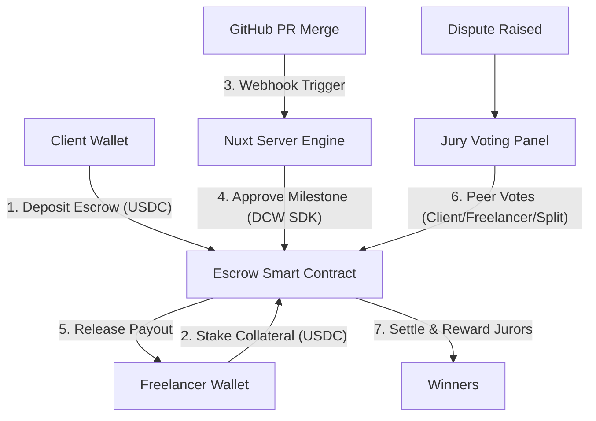

# 💼 GigMarket: Decentralized On-Demand Freelance Commerce Stack
An automated freelance marketplace with mutual-staking escrow protection and git-triggered programmatic payouts, built on **Arc Testnet** and **Circle Developer Platform**.

---

## 🌟 Overview
GigMarket solves the classic freelancing alignment problem (disputes, chargebacks, and non-payment) by introducing a **Two-Way Alignment Escrow**. 

1. **Mutual Collateral Staking**: Both the client and the freelancer put skin in the game. The client locks the project budget (in USDC), and the freelancer stakes a percentage of the budget as performance collateral.
2. **Dynamic Reputation Discount**: Freelancers earn Reputation Points for successful projects, dynamically lowering their required stake on future projects down to 0%.
3. **Git-Triggered Auto-Payouts**: Integrates with GitHub pull requests. Merging a PR fires a webhook that triggers a transaction from a **Circle Developer-Controlled Wallet** to automatically release milestone funds on-chain.
4. **Decentralized Juror Pool**: Disputed gigs are routed to a decentralized jury room where peer jurors vote on the split. Jurors receive 2% of the total escrow pool for their arbitration services.

---

## ⚙️ Architecture & Features



### Core Features Deployed:
*   **Feature A (Two-Way Alignment Escrow)**: Lock budgets and stake performance collaterals to guarantee honest deliverables.
*   **Feature B (Git-Triggered Auto-Payout)**: Automatic payouts via Circle Developer-Controlled Wallets upon GitHub PR merge events.
*   **Feature C (Decentralized Jury Resolution)**: Peer-to-peer voting room with automated payouts and incentive fees split for jurors.
*   **Feature D (Dynamic Reputation Staking)**: Dynamic on-chain reputation points calculated to discount required freelancer staking limits.
*   **Circle App Kit Integration**: Fully integrated browser-side `@circle-fin/app-kit` for executing real-time stablecoin FX Swaps (USDC ↔ EURC) and native payments on Arc Testnet.

---

## 🛠 Technology Stack
*   **Smart Contracts**: Solidity `0.8.20` + Hardhat ESM
*   **Web Framework**: Vue.js (Nuxt 3 SPA mode)
*   **Blockchain Integration**: `viem` + `@circle-fin/app-kit` + `@circle-fin/adapter-viem-v2`
*   **Automation Agent**: NodeJS + `@circle-fin/developer-controlled-wallets`

---

## 🚀 Smart Contract Details
The core contract `GigMarketEscrow.sol` is deployed on **Arc Testnet**:
*   **Contract Address**: `0xbd13b6e6236f30e21d6a924fbe8085282bcc3b2b`
*   **Native Gas & Currency**: Native USDC (`0x3600000000000000000000000000000000000000`)
*   **Explorer Link**: [https://testnet.arcscan.app/address/0xbd13b6e6236f30e21d6a924fbe8085282bcc3b2b](https://testnet.arcscan.app/address/0xbd13b6e6236f30e21d6a924fbe8085282bcc3b2b)

---

## 💻 Running the Application

### 1. Configure the Environment
Create a `.env` file in the root folder (or update the existing one):
```env
# Private key of the deployer wallet (funded with USDC for gas on Arc Testnet)
PRIVATE_KEY="your-wallet-private-key"

# Circle Developer Platform API Configuration
CIRCLE_API_KEY="your-circle-api-key"
CIRCLE_ENTITY_SECRET="your-32-byte-hex-entity-secret"
CIRCLE_WALLET_ID="your-developer-controlled-wallet-id"

# Circle Console Kit Key for App Kit Swap operations
KIT_KEY="your-circle-app-kit-key"

# Secret used to sign GitHub webhook payloads
GITHUB_WEBHOOK_SECRET="your-webhook-secret"
```

### 2. Install Dependencies
```bash
npm install
```

### 3. Compile Contracts (Optional)
```bash
npm run compile
```

### 4. Deploy to Arc Testnet (Optional)
```bash
npm run deploy
```

### 5. Launch the Web Application
```bash
npm run dev
```
Open `http://localhost:3000` in your web browser. Make sure you have MetaMask or an EVM wallet installed and switched to the **Arc Testnet** network:
*   **Chain ID**: `5042002`
*   **RPC URL**: `https://rpc.testnet.arc.network`
*   **Currency Symbol**: `USDC`
*   **Block Explorer**: `https://testnet.arcscan.app`

---

## 🎯 Verification Guide (No Mocks)
1.  **Connect Wallet**: Click **Connect Wallet** in the navbar to read your Arc Testnet account.
2.  **Post a Gig**: Go to **Client Portal**, enter your job details and budget. The interface requests two transactions:
    *   `approve` to grant the Escrow contract allowance to transfer your USDC.
    *   `createJob` to transfer and lock the funds on-chain.
3.  **Apply and Join**: Switch to another account, go to **Freelancer Portal**, find the gig and click **Join**. The system calculates your dynamic required stake on-chain and triggers the deposit.
4.  **Simulate Merge / Deliver**: Click **Simulate Merge** to simulate a GitHub Pull Request closure. The backend server intercepts the event and executes `approveMilestone` on-chain through the configured Circle wallet agent.
5.  **Dispute & Vote**: If a dispute occurs, raise a dispute. Active jurors can head to the **Jury Board** to vote on how funds should be disbursed and execute the arbitration payout dynamically.
