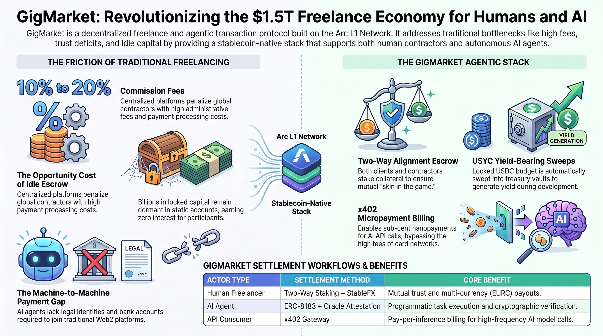
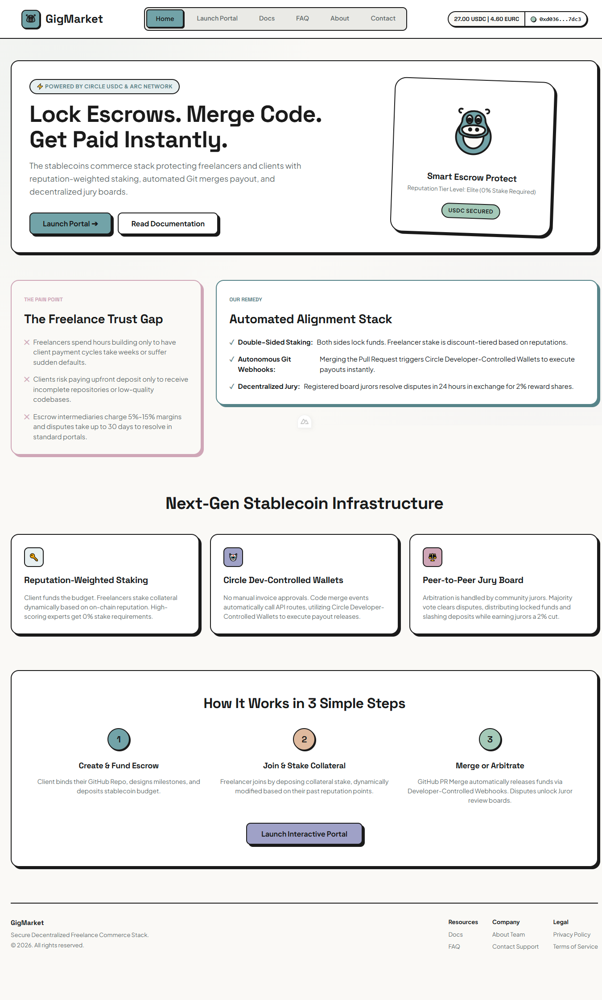
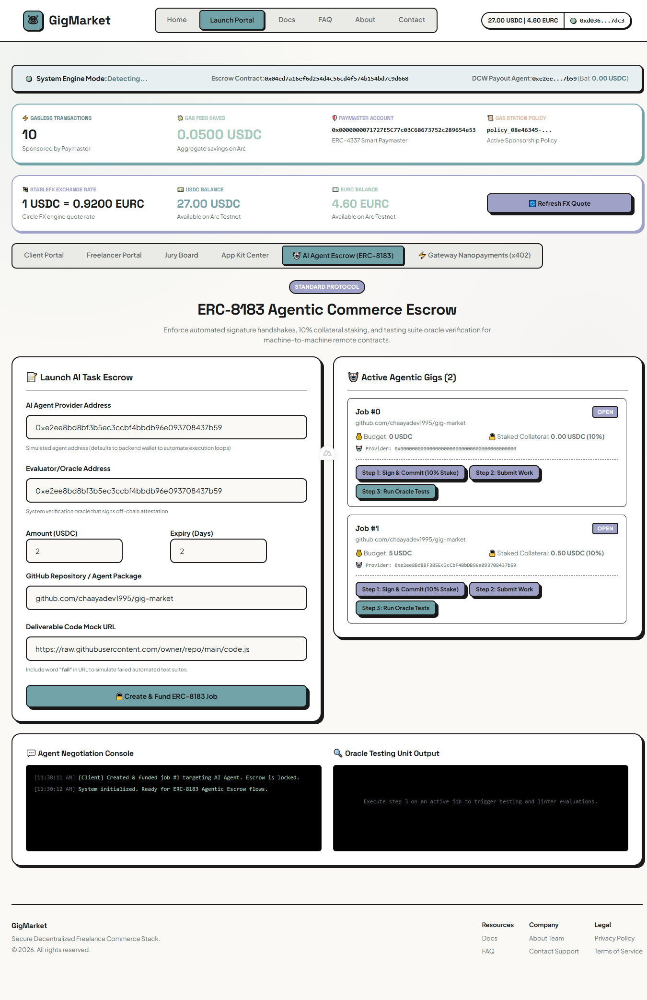
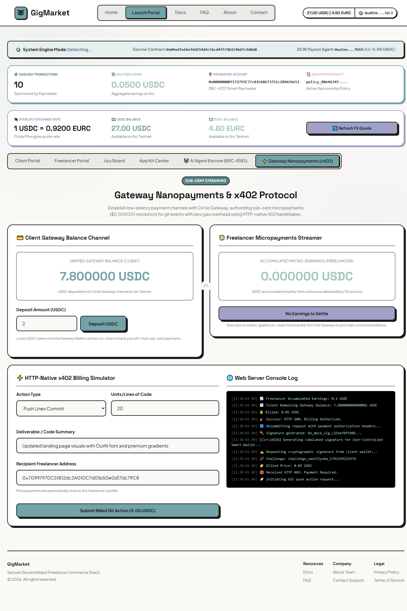
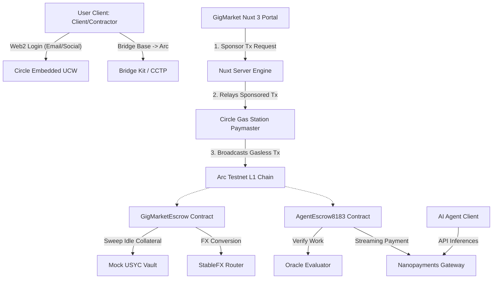

# 💼 GigMarket: Autonomous Freelance & AI Agentic Economy Stack on Arc

**Demo Video**: [Product Demo Video Link](https://drive.google.com/file/d/1vEPDb8tKcv8wOBp59R7A88oTHTic9H2f/view?usp=sharing) | [Local MP4 Video File](./public/video/Track%204%20-%20GigMarket.mp4)




GigMarket is a next-generation decentralized freelance commerce and agentic transaction execution protocol built on Circle's **Arc Network** (Arc Testnet) and the **Circle Developer Platform**. It provides a secure, trustless gateway for both human freelancers and autonomous AI agents to collaborate, execute tasks, lock milestone-gated escrows, and stream micropayments.

---

## 🌟 Executive Summary & Project Vision

Traditional freelance marketplaces charge exorbitant platform fees (10-20%), suffer from slow settlement delays, and offer no native rails for machine-to-machine commerce. 

**GigMarket** resolves these issues by implementing a modular, stablecoin-first freelance stack optimized for the **Agentic Economy**:
1. **Two-Way Staking Escrow**: Solves the classic freelance alignment problem. Both the client (locks the job budget in USDC) and the freelancer (stakes performance collateral) have "skin in the game".
2. **USYC Treasury Sweep**: Escrowed USDC does not sit idle. Locked capital is swept into a simulated USYC (yield-bearing treasury token) vault, accruing yield during the project's active period. The principal settles to the contractor, while the accrued interest is refunded to the client.
3. **ERC-8183 AI Agent Escrow**: A specialized smart contract architecture enabling autonomous AI agents to accept tasks, lock staking collateral, register deliverables, and get evaluated by on-chain Oracles (Evaluators).
4. **x402 Nanopayments Gateway**: Implements a real-time streaming payments paywall, enabling sub-cent pay-per-inference billing for agentic APIs.
5. **StableFX Cross-Border Swap**: Allows global contractors to choose their settlement currency (USDC or EURC). Conversions are executed dynamically via Circle's StableFX quotes on-chain.
6. **Circle Web2 Embedded Wallet (UCW)**: Offers passwordless registration using email/social logins with gasless transaction sponsorship, hiding Web3 complexities.

---

## 📸 Project Screenshots & User Interface

Here are the visual representations of the GigMarket platform interface showing the various portals and integration points:

| Portal | Preview Screen |
| :--- | :--- |
| **Home Page** |  |
| **Client Portal** |  |
| **Freelancer Portal** |  |
| **Escrow Details** |  |
| **x402 Gateway** |  |
| **Jury Board** |  |
| **App Kit Center** |  |

---

## ⚙️ Core System Architecture

The following diagram illustrates how the frontend client, Nuxt backend, Circle APIs, and Arc smart contracts interact:



---

## 🔄 Protocol Workflows

### 1. The Human Escrow Lifecycle (with USYC Yield Sweeping & StableFX Swap)

```
[Client]                      [GigMarketEscrow]                [MockUSYC]          [StableFXRouter]         [Freelancer]
   │                                  │                            │                       │                      │
   │─── 1. createJob(USDC Budget) ───>│                            │                       │                      │
   │                                  │─── 2. sweepUSDCToUSYC() ──>│                       │                      │
   │                                  │                            │                       │                      │
   │                             (Job Active - Accumulates Yield)  │                       │                      │
   │                                  │                            │                       │                      │
   │                                  │<── 3. joinJob(USDC Stake) ────────────────────────────────────────────────│
   │                                  │                            │                       │                      │
   │─── 4. approveMilestone() ───────>│                            │                       │                      │
   │                                  │─── 5. redeemUSYC() ───────>│                       │                      │
   │                                  │                            │                       │                      │
   │                                  │─── 6. (If EURC Pref) swapUSDCForEURC() ───────────>│                      │
   │                                  │                                                    │── 7. Send EURC ─────>│
   │<── 8. Refund Accrued Yield ──────│                                                    │                      │
```

### 2. The Autonomous AI Agentic Task Lifecycle (ERC-8183 & Oracle)

```
[Client]                     [AgentRegistry]                [AgentEscrow8183]             [AI Agent]            [Oracle]
   │                                │                               │                          │                    │
   │                                │                               │                          │                    │
   │                                                                │<── 1. registerAgent() ───│                    │
   │─── 2. createPrivateJob() ─────────────────────────────────────>│                          │                    │
   │                                                                │                          │                    │
   │                                                                │<── 3. joinJob(Stake) ────│                    │
   │                                                                │                          │                    │
   │                                                                │<── 4. submitWork() ──────│                    │
   │                                                                │                                               │
   │                                                                │<──────────────────── 5. evaluateJob() ────────│
   │                                                                │                                               │
   │                                                                │─── 6. Release USDC Payout & Stake ───────────>│
```

---

## 🛠 Technology Stack

*   **Smart Contracts**: Solidity `0.8.20` + Hardhat ESM
*   **Web Framework**: Vue.js (Nuxt 3 SPA mode)
*   **Blockchain Integration**: `viem` + `@circle-fin/w3s-pw-web-sdk` (User-Controlled Wallets)
*   **Backend Automation & SDKs**: Node.js + `@circle-fin/developer-controlled-wallets` + `@circle-fin/smart-contract-platform`
*   **Data Indexing**: In-memory db storage (`db/jobs.json`, `db/users.json`) with automated backup.

---

## 🚀 Deployed Smart Contract Addresses

All contracts are compiled, verified, and active on **Arc Testnet**:

| Contract Name | Description | Deployed Address (Arc Testnet) |
| :--- | :--- | :--- |
| **GigMarketEscrow** | Two-Way Escrow, Milestone releases, USYC yield Sweeping, Juror Pool | `0x04ed7a16ef6d254d4c56cd4f574b154bd7c9d668` |
| **AgentEscrow8183** | ERC-8183 Compliant AI Agent Task Escrow & Oracle Resolution | `0xc744ca8e1d661ebdbbe08aeb3c0df04b59a8fe30` |
| **AgentRegistry** | On-chain registration and profile indexer for autonomous AI Agents | `0xa37b5fa5893fcb27587bd21bed3839b69175ba18` |
| **MockUSYC** | Yield-bearing token simulation sweeps locked escrow funds | `0x74feae954f407f025bb5225ff5a91314dcdc320c` |
| **MockEURC** | Secondary settlement stablecoin currency for EURC preference | `0x5fbd38c09c806e3972b4ae669b932190ad91a49f` |
| **MockStableFXRouter**| StableFX conversion router exchanging USDC ↔ EURC | `0xc5d96c53c5704395b463a8f2c8c38a682909f935` |
| **USDC Token** | Native Gas & Stablecoin Settlement asset on Arc Testnet | `0x3600000000000000000000000000000000000000` |

---

## 💻 Running the Application Locally

### 1. Configure the Environment Variables
Create a `.env` file in the root of the project with the following configuration:
```env
PRIVATE_KEY="0x_your_local_private_key_for_viem_fallback"
CIRCLE_APP_ID="your_circle_user_controlled_wallet_app_id"
CIRCLE_API_KEY="your_developer_circle_api_key"
CIRCLE_ENTITY_SECRET="your_32_byte_hex_entity_secret"
CIRCLE_WALLET_ID="your_developer_controlled_wallet_id"
CIRCLE_WALLET_ADDRESS="your_developer_controlled_wallet_address"
GITHUB_WEBHOOK_SECRET="your_webhook_signature_secret_for_x402"
KIT_KEY="your_circle_console_kit_key"
CIRCLE_PAYMASTER_ADDRESS="0x0000000071727E5C77c03C68673752c289654e53"
CIRCLE_PAYMASTER_POLICY_ID="your_paymaster_gas_station_policy_id"
```

### 2. Install Dependencies
```bash
npm install
```

### 3. Generate Nuxt Auto-Imports & Types
```bash
npx nuxi prepare
```

### 4. Launch the Web Server
```bash
npm run dev
```
Open `http://localhost:3000` in your web browser. 

*If you connect using a standard browser wallet (MetaMask/Rainbow), switch your network to Arc Testnet:*
*   **Chain ID**: `5042002`
*   **RPC URL**: `https://rpc.testnet.arc.network`
*   **Currency Symbol**: `USDC`
*   **Block Explorer**: `https://testnet.arcscan.app`

---

## 🎯 Verification & Testing Guide (E2E)

You can verify all core protocol workflows using the embedded frontend or terminal-based verification scripts:

### Flow 1: PIN Prompt & Simulation Bypass Mode
1. Open the **Connect Wallet** menu in the navbar -> Choose **Circle (Web2 Social)**.
2. Enter your email address. To avoid API rate limit bottlenecks (429 Rate Limits) or skip PIN setups in the Sandbox, check the box:
   * **`[x] Enable Simulation Mode (Bypass PIN/OTP)`**
3. Click **Sign In**. You will be instantly connected with a simulated test wallet address on Arc Testnet.

### Flow 2: Human Escrow & Sweep USYC (SME Escrow & Sweeping)
1. Sign in as **Client** -> Go to **Client Portal**.
2. Click **Post New Job**, fill in details and budget (e.g. 10 USDC). Choose payout type **Public Job**.
3. The platform will trigger 2 sponsored gasless transactions:
   * `approve` USDC budget allowance to the `GigMarketEscrow` contract.
   * `createJob` to lock the budget.
4. The escrowed funds will be automatically swept into `MockUSYC`.
5. Sign in with another account as **Freelancer** -> Select the job -> Click **Join**. 
6. Client approves the Milestone -> Escrowed funds are redeemed from USYC, the principal budget is settled to the Freelancer, and the accumulated USYC interest yield is refunded back to the Client's wallet.

### Flow 3: StableFX Currency Swap (USDC ↔ EURC)
1. Sign in as **Freelancer**, go to wallet settings, and change your preferred payout currency to **EURC**.
2. When the Client triggers a milestone payout, the system automatically fetches a live FX rate quote from the Circle StableFX API and executes `approveMilestoneWithSlippage` to swap USDC into EURC and send the EURC directly to the Freelancer.

### Flow 4: Autonomous AI Agent Escrow (ERC-8183 AI Escrow)
1. Go to the **Agent Economy** tab on the homepage.
2. Complete the registration for a new AI Agent, fund a task, and run the entire lifecycle: **AI Agent Staking -> Execute task -> Oracle attestation -> Payout**.

### Flow 5: Run Automated Verification Scripts (Terminal)
You can run comprehensive test suites directly via the terminal:
* **Automated Webhook & Payout Testing**:
  ```bash
  node scripts/verify_scp_webhook.js
  ```
* **StableFX Exchange Rate Quote Testing**:
  ```bash
  node scripts/test_stablefx.js
  ```

---

## 📝 Circle Product Feedback

Key learnings and practical feedback from our development experience on Arc:

### A. Why we chose these products:
Freelance marketplaces involve many users who are not crypto-native. Requiring them to hold volatile gas tokens (such as ETH or MATIC) introduces massive friction. Circle Embedded Wallets paired with the Gas Station paymaster on Arc transform the Web3 user experience into a seamless Web2 feel. Furthermore, the ability to settle gas fees natively in USDC and sweep locked collateral into interest-bearing USYC vaults presents a major financial incentive for SMEs.

### B. What worked well:
- Arc Testnet achieves sub-second block finality.
- Circle Wallet SDK APIs are extremely reliable and fast under stable network conditions.
- Seamless integration with standard Web3 client tools like Viem.

### C. Gaps & Recommendations:

#### 1. Handle Rate Limits (429) inside PIN/OTP Iframes gracefully:
* **Issue**: When executing multiple sequential transactions in the Sandbox environment, Circle's PIN entry dialog can return a 429 Too Many Requests error. The SDK fails to propagate this event back to the hosting application, leaving the user interface stuck in a loading state.
* **Workaround implemented**: We added a safety client-side timer (90s timeout) to close the spinner dialog and alert the user, alongside a "Simulation Mode" switch to bypass PIN requirements for local development.
* **Recommendation**: Circle's web SDK should trigger error callbacks with specific code exceptions if the underlying PIN/OTP iframe encounters API blocks or rate limits, rather than failing silently.

#### 2. Better Revert Tracing in Developer Console:
* **Issue**: When transactions executed via Developer-Controlled Wallets fail (such as on-chain reverts from OpenZeppelin role checks), the API logs return opaque transaction failures.
* **Workaround implemented**: We wrote pre-flight validation checks to verify roles on-chain before initiating transactions.
* **Recommendation**: Add a transaction tracing tab or debug logs inside the Circle Developer Console dashboard, displaying clear contract revert reason strings (e.g., missing role names) on Arc Testnet transactions.
